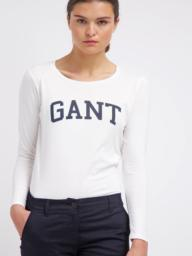
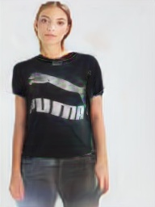
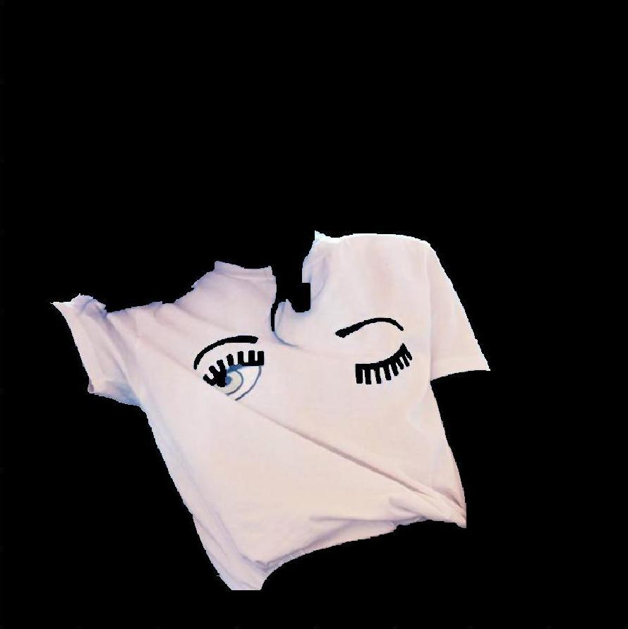

# Style
App for virtual fitting of clothing fitting.

## Main functionality:
This app is designed to show you how you will look in your chosen clothes.

[Demonstration](https://drive.google.com/file/d/15Cb37ovY1rqtocVPbV_EHjqrzC_HdXBi/view?usp=sharing)

| Clothes\Persons |  |  |  |  |
|---|---|---|---|---|
|  |  |  |  |  |
|  |  |  |  |  |
|  |  |  |  |  |

How does this happen:
1. You choose the type of clothing (t-shirt, pants, sweater, etc.)
2. You choose a specific clothing model
3. Upload a photo of a person
4. Get a generated photo of this person in the selected clothing

## Implementation
The app consists of two main parts an Android app and a REST API server.

### Android
Through the Android app, the user selects things to try on and uploads their photo. Then it sends data to the server and receives the image that has already been generated.

**Technologies used:** Android Studio, Java, and OkHttp.

### Server
The server processes the image. Communication with the client side is performed via the REST API. Several models are implemented here: segmentation of clothing, segmentation of the human head and body, definition of key points, and a model for image generation (GAN).

**Technologies used:** Flask, Python, PyTorch, Detectron2, DensePose, and Mask R-CNN.

### Segmentation
For clothing segmentation, we used a combination of Mask R-CNN and the GrabCut algorithm. Using a neural network, we get a clothing class, an approximate mask, and a bounding box. GrabCut makes the mask more accurate.

|Mask R-CNN|Aplying GrabCut|Result|
|---|---|---|
|  |  |  |
